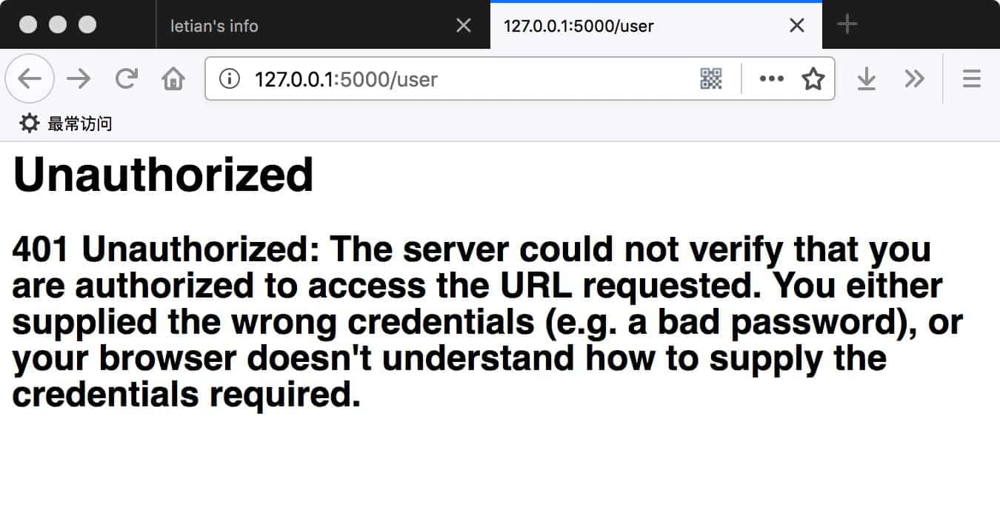

# 012. 自定义404等错误的响应

要处理HTTP错误，可以使用`flask.abort`函数。


### 12.1 示例1：简单入门

#### 建立Flask项目
按照以下命令建立Flask项目HelloWorld:
```
mkdir HelloWorld
mkdir HelloWorld/static
mkdir HelloWorld/templates
touch HelloWorld/server.py
```
#### 代码
编辑`HelloWorld/server.py`：
```python
from flask import Flask, render_template_string, abort

app = Flask(__name__)


@app.route('/')
def hello_world():
    return 'hello world'


@app.route('/user')
def user():
    abort(401)  # Unauthorized 未授权
    print('Unauthorized, 请先登录')


if __name__ == '__main__':
    app.run(port=5000, debug=True)
```
#### 效果
运行`HelloWorld/server.py`，浏览器访问`http://127.0.0.1:5000/user`，效果如下：


要注意的是，`HelloWorld/server.py`中`abort(401)`后的`print`并没有执行。

### 12.2 示例2：自定义错误页面

#### 代码

将服务器代码改为：
```python
from flask import Flask, render_template_string, abort

app = Flask(__name__)


@app.route('/')
def hello_world():
    return 'hello world'


@app.route('/user')
def user():
    abort(401)  # Unauthorized


@app.errorhandler(401)
def page_unauthorized(error):
    return render_template_string('<h1> Unauthorized </h1><h2>{{ error_info }}</h2>', error_info=error), 401


if __name__ == '__main__':
    app.run(port=5000, debug=True)
```

`page_unauthorized`函数返回的是一个元组，401 代表HTTP 响应状态码。如果省略401，则响应状态码会变成默认的 200。

#### 效果
运行`HelloWorld/server.py`，浏览器访问`http://127.0.0.1:5000/user`，效果如下：




### 12.3 本节源码
https://github.com/letiantian/flask-tutorial/tree/master/demo/flask-demo-010


<!-- flask-tutorial-info -->


---

* 上一篇 [011. 使用Jinja2模板引擎](011.%20%E4%BD%BF%E7%94%A8Jinja2%E6%A8%A1%E6%9D%BF%E5%BC%95%E6%93%8E.md)
* 下一篇 [013. 用户会话](013.%20%E7%94%A8%E6%88%B7%E4%BC%9A%E8%AF%9D.md)

> 本教程讲述如何使用 Python Flask Web 框架，如有错误/建议，欢迎交流。

