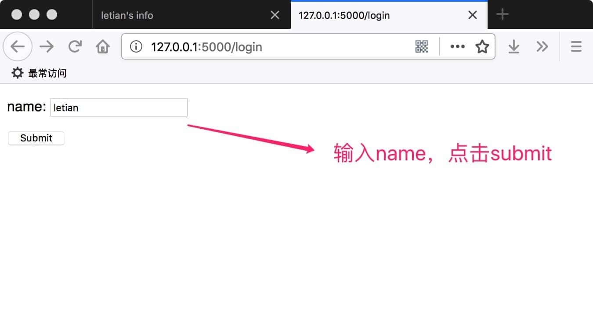
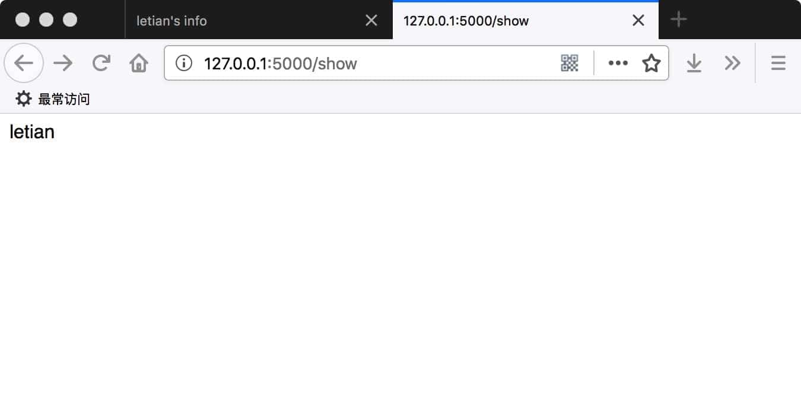

# 013. 用户会话

session用来记录用户的登录状态，一般基于cookie实现。

下面是一个简单的示例。

### 13.1 建立Flask项目
按照以下命令建立Flask项目HelloWorld:
```
mkdir HelloWorld
mkdir HelloWorld/static
mkdir HelloWorld/templates
touch HelloWorld/server.py
```

### 13.2 编辑`HelloWorld/server.py`
内容如下：
```python
from flask import Flask, render_template_string, \
    session, request, redirect, url_for

app = Flask(__name__)

app.secret_key = 'F12Zr47j\3yX R~X@H!jLwf/T'


@app.route('/')
def hello_world():
    return 'hello world'


@app.route('/login')
def login():
    page = '''
    <form action="{{ url_for('do_login') }}" method="post">
        <p>name: <input type="text" name="user_name" /></p>
        <input type="submit" value="Submit" />
    </form>
    '''
    return render_template_string(page)


@app.route('/do_login', methods=['POST'])
def do_login():
    name = request.form.get('user_name')
    session['user_name'] = name
    return 'success'


@app.route('/show')
def show():
    return session['user_name']


@app.route('/logout')
def logout():
    session.pop('user_name', None)
    return redirect(url_for('login'))


if __name__ == '__main__':
    app.run(port=5000, debug=True)
```

### 13.3 代码的含义
`app.secret_key`用于给session加密。

在`/login`中将向用户展示一个表单，要求输入一个名字，submit后将数据以post的方式传递给`/do_login`，`/do_login`将名字存放在session中。

如果用户成功登录，访问`/show`时会显示用户的名字。此时，打开firebug等调试工具，选择session面板，会看到有一个cookie的名称为`session`。

`/logout`用于登出，通过将`session`中的`user_name`字段pop即可。Flask中的session基于字典类型实现，调用pop方法时会返回pop的键对应的值；如果要pop的键并不存在，那么返回值是`pop()`的第二个参数。

另外，使用`redirect()`重定向时，一定要在前面加上`return`。

### 13.4 效果

进入`http://127.0.0.1:5000/login`，输入name，点击submit：


进入`http://127.0.0.1:5000/show`查看session中存储的name：


### 13.5 设置sessin的有效时间
下面这段代码来自[Is there an easy way to make sessions timeout in flask?](http://stackoverflow.com/questions/11783025/is-there-an-easy-way-to-make-sessions-timeout-in-flask)：
```
from datetime import timedelta
from flask import session, app

session.permanent = True
app.permanent_session_lifetime = timedelta(minutes=5)
```
这段代码将session的有效时间设置为5分钟。

### 13.6 本节源码
https://github.com/letiantian/flask-tutorial/tree/master/demo/flask-demo-011


<!-- flask-tutorial-info -->


---

* 上一篇 [012. 自定义404等错误的响应](012.%20%E8%87%AA%E5%AE%9A%E4%B9%89404%E7%AD%89%E9%94%99%E8%AF%AF%E7%9A%84%E5%93%8D%E5%BA%94.md)
* 下一篇 [014. 使用Cookie](014.%20%E4%BD%BF%E7%94%A8Cookie.md)

> 本教程讲述如何使用 Python Flask Web 框架，如有错误/建议，欢迎交流。

